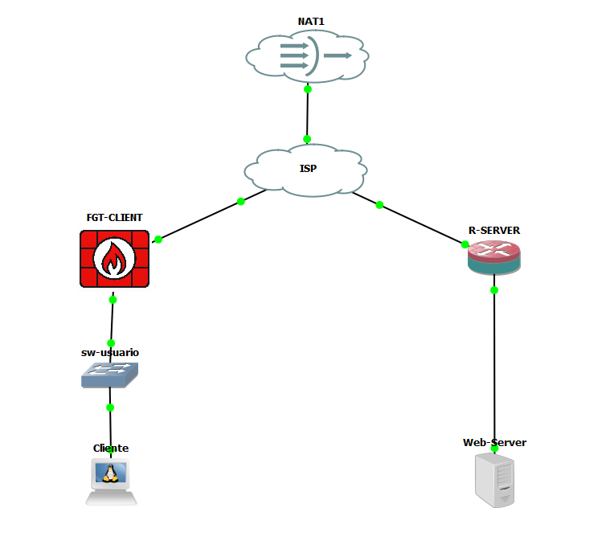

# Infraestructura 2 - VPN Site-to-Site FortiGate ↔ Cisco

> 🎥 **VIDEO DEMOSTRATIVO (máximo 10 min):** [AGREGAR ENLACE DE YOUTUBE U ONEDRIVE AQUÍ]

**Matrícula:** 2025-0693  
**Plataforma:** GNS3  
**Objetivo:** demostrar que el usuario de la red cliente puede acceder al servidor web HTTPS de la red remota **solamente cuando la VPN Site-to-Site está operativa**.

## Resumen
La infraestructura utiliza un FortiGate en el lado cliente y un router Cisco en el lado servidor. Ambos extremos negocian una VPN IPsec Site-to-Site a través de un router ISP. El cliente obtiene su dirección por DHCP en el segmento de usuarios y el servidor HTTPS utiliza direccionamiento estático.

## Direccionamiento
| Elemento | Interfaz/rol | Dirección |
|---|---|---|
| FGT-CLIENT | WAN port1 | 200.6.93.2/30 |
| ISP | hacia FortiGate | 200.6.93.1/30 |
| ISP | hacia R-SERVER | 200.6.93.5/30 |
| R-SERVER | WAN Fa0/0 | 200.6.93.6/30 |
| FGT-CLIENT | LAN port2, segmento VLAN10 | 10.6.93.1/25 |
| Cliente Ubuntu | DHCP | 10.6.93.2/25 (observado) |
| R-SERVER | LAN Gi2/0 | 10.6.93.129/28 |
| Web-Server | HTTPS | 10.6.93.130/28 |

## Evidencia principal
- IKE en Cisco: `QM_IDLE` y `ACTIVE`.
- IPsec en Cisco: 50 paquetes encapsulados/cifrados y 70 decapsulados/descifrados, sin errores en la captura final.
- FortiGate muestra Fase 1 y Fase 2 activas y tráfico de entrada/salida.
- Con la ruta VPN habilitada, `curl -k https://10.6.93.130` devuelve la página HTTPS.
- Con la ruta VPN deshabilitada, la conexión HTTPS falla.
- `traceroute 10.6.93.130` alcanza el servidor remoto.

## Documentación
- [Documento técnico en Word](docs/Documento_Tecnico_Infra2_2025-0693.docx)
- [Documento técnico en Markdown](docs/documentacion-tecnica.md)
- [Configuraciones](configs/)
- [Script de servidor HTTPS](scripts/setup-webserver.sh)
- [Capturas de evidencia](screenshots/)

## Seguridad del repositorio
El respaldo original del FortiGate contiene material sensible. Para publicación se incluye una copia sanitizada. Consulte [`configs/SECURITY-NOTE.md`](configs/SECURITY-NOTE.md).
