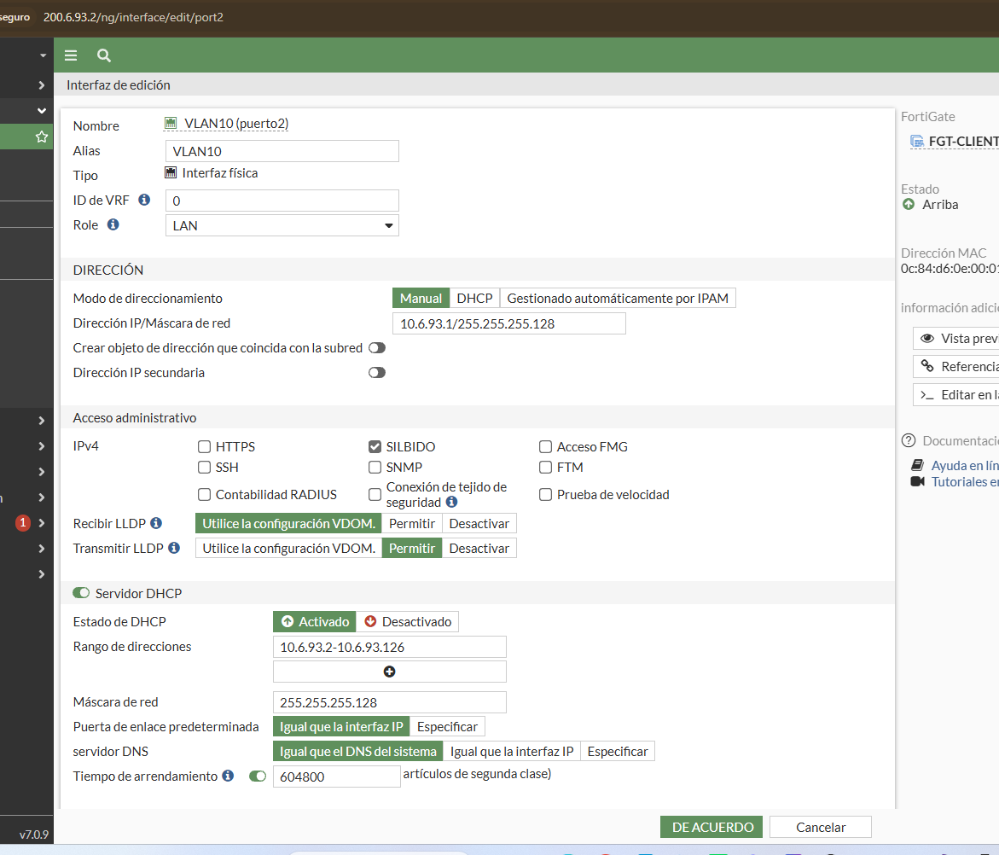
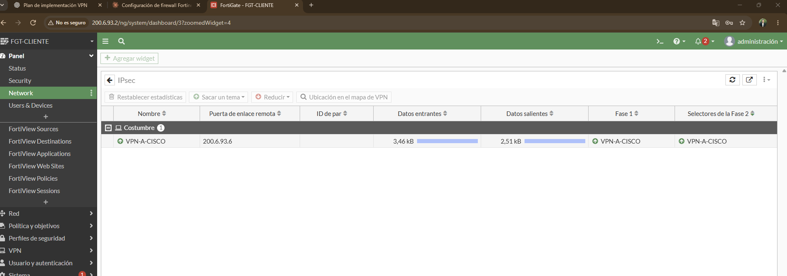
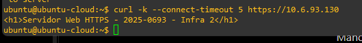
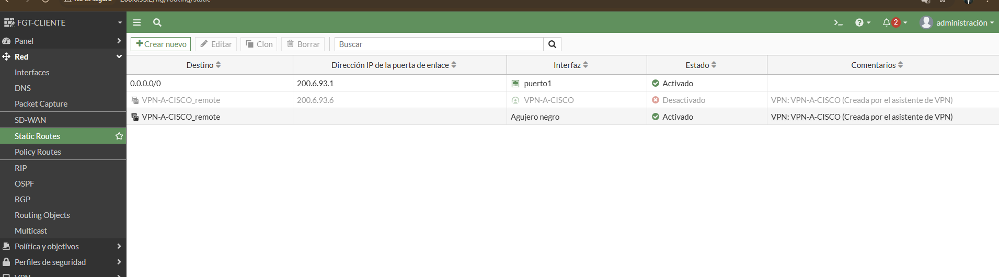
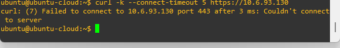
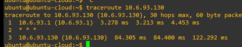

# Documentación técnica - Infraestructura 2

## 1. Propósito del laboratorio
Implementar y validar una VPN IPsec Site-to-Site entre un FortiGate y un router Cisco en GNS3. El criterio de seguridad es que el usuario de la red cliente alcance el servidor HTTPS remoto únicamente mientras la VPN esté disponible.

## 2. Topología

La ruta lógica es: Cliente → SW-USUARIO → FGT-CLIENT → ISP → R-SERVER → Web-Server. NAT1 proporciona conectividad externa de laboratorio y no forma parte del tráfico protegido entre las LAN.

## 3. Direccionamiento
- Usuarios: `10.6.93.0/25`; gateway `10.6.93.1`; DHCP `10.6.93.2-10.6.93.126`.
- Servidores: `10.6.93.128/28`; gateway `10.6.93.129`; servidor `10.6.93.130`.
- WAN FortiGate-ISP: `200.6.93.0/30` (`.1` ISP, `.2` FortiGate).
- WAN ISP-Cisco: `200.6.93.4/30` (`.5` ISP, `.6` Cisco).

## 4. FortiGate
FortiOS 7.0.9. `port1` usa `200.6.93.2/30`. `port2` es una interfaz física con alias VLAN10 y `10.6.93.1/25`; el DHCP entrega `10.6.93.2-10.6.93.126`. El túnel `VPN-A-CISCO` usa como peer `200.6.93.6`, IKEv1 Main Mode, DES/SHA1, DH14 y PFS DH14. Los selectores protegen `10.6.93.0/25 ↔ 10.6.93.128/28`. Las políticas VPN no usan NAT.

## 5. Cisco R-SERVER
La WAN es `200.6.93.6/30` y la LAN de servidores `10.6.93.129/28`. El crypto map `CMAP` se aplica a Fa0/0. La ACL `VPN-TRAFICO` identifica el tráfico entre ambas LAN y la ACL de NAT excluye ese tráfico antes del PAT. La PSK se oculta en la copia pública.

## 6. Servidor HTTPS
Ubuntu usa `10.6.93.130/28`, gateway `10.6.93.129`. Nginx escucha en TCP/443 con certificado autofirmado. La página de prueba identifica matrícula e infraestructura. El script reproducible está en `scripts/setup-webserver.sh`.

## 7. Validación de VPN
La captura del FortiGate muestra Fase 1 y Fase 2 activas con tráfico. En Cisco, `show crypto isakmp sa` mostró `QM_IDLE ACTIVE`; `show crypto ipsec sa` registró 50 paquetes cifrados y 70 descifrados, sin errores.

## 8. Prueba del objetivo de seguridad
Con la ruta de la VPN habilitada, HTTPS responde correctamente:

Al deshabilitar en la GUI del FortiGate la ruta hacia la red remota por `VPN-A-CISCO`, el túnel deja de transportar el flujo y `curl` no puede conectar al puerto 443:

Después de reactivar la ruta, el acceso HTTPS vuelve a funcionar. Esto demuestra la dependencia del servicio respecto de la VPN.

## 9. Traceroute
El cliente alcanzó `10.6.93.130`; el primer salto fue `10.6.93.1`. El salto intermedio no respondió a traceroute (`* * *`), pero el destino final sí fue alcanzado.

## 10. Conclusión
La infraestructura cumple el objetivo funcional definido para el laboratorio: comunicación HTTPS entre las LAN a través de la VPN IPsec, pérdida de acceso al retirar la ruta VPN y recuperación al restablecerla. La evidencia IKE/IPsec confirma además que existieron asociaciones activas y tráfico cifrado real.
